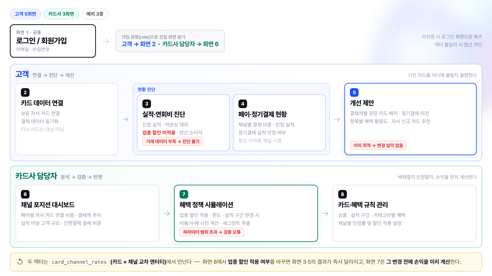
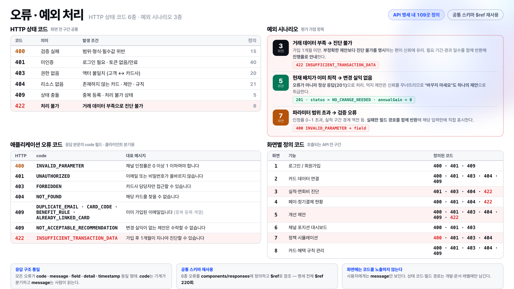

<div align="center">

# PayMix

### AI 카드 배치 최적화 서비스

**AI가 페이 뒤에 숨은 업종을 찾아내, 어느 카드를 물릴지 알려줍니다.**

`똑똑한 소비, 페이와의 상생`

SKALA 4기 · AI 웹 서비스 설계 Mini-project · 판교 3반 P074 박수빈

</div>

---

## 무엇을 푸는가

간편결제로 결제하면 카드사에 들어오는 가맹점명이 **`네이버파이낸셜`** 처럼 페이사 대표 가맹점으로 바뀝니다.
업종을 알 수 없으니 카드사는 그 결제를 **업종별 할인 대상에서 제외**합니다.

> ### 전월실적은 최고 등급을 채웠는데, 받은 할인은 0원

실제 데모 계정에서 재현되는 상황입니다. 실적 **573,000원**으로 최고 등급인데 할인은 **0원** —
네이버·카카오페이를 거친 결제가 전부 업종 판정에 실패했기 때문입니다.

**결제처를 바꿀 필요도, 카드를 새로 만들 필요도 없습니다.**
이미 가진 카드를 **어디에 물릴지만** 바꾸면 회복됩니다. PayMix는 그 배치를 계산합니다.

### 손실은 성격이 다른 두 가지

| 유형 | 원인 | 카드를 바꾸면 |
|---|---|---|
| **약관상 실적 제외** | 통신비 · 공과금 · 구독료 · 선불충전 | 달라지지 않음 |
| **업종 할인 미적용** | 간편결제 경유로 **업종 판정 불가** | **전액 회복** |

기존 서비스는 이 둘을 뭉뚱그려 *"실적이 부족합니다"* 라고만 말합니다.
PayMix는 **분리해서, 고칠 수 있는 것만 고치라고** 말합니다.

---

## 비즈니스 모델 — B2B2C

```
PayMix (공급)  →  카드사 (구매·운영)  →  카드사의 고객 (사용)
```

| 액터 | 얻는 것 | 화면 |
|---|---|---|
| **고객** | 받아야 할 혜택 · 배치 제안 | 2 · 3 · 4 · 5 |
| **카드사 담당자** | 채널 포지션 분석 · 정책 손익 시뮬레이션 | 6 · 7 · 8 |
| 결제 승인계 *(외부)* | 거래 데이터 송신 — 인터페이스만 정의 | — |

고객이 원하는 것은 **혜택 최대화**, 카드사가 원하는 것은 **결제 집중**입니다.
최적 배치를 제안하면 둘 다 얻습니다. **두 목표는 충돌하지 않습니다.**

---

## UI 흐름



---

## 산출물

| 파일 | 내용 |
|---|---|
| [`…-개요.html`](deliverables/) | 프로젝트 기술서 **21p** — 개요 · 배경 · 문제 정의 · 액터 · **전체 화면 와이어프레임 11장** · ERD · API · 고려사항 |
| [`…-DB.dbml`](deliverables/) | 데이터 모델 — 테이블 **14** / Enum 8 / 관계 24 / 컬럼 127 |
| [`…-API.yml`](deliverables/) | OAS 3.0.3 — **34 Path / 41 Operation / 55 Schema** / `$ref` 221회 |

기술서는 브라우저에서 열어 `Cmd+P` → *배경 그래픽 체크* → PDF로 저장합니다.
DBML은 [dbdiagram.io](https://dbdiagram.io), API 명세는 [Swagger Editor](https://editor-next.swagger.io)에 붙여넣어 확인합니다.

---

## 실행

Vue 3 + Vite. **백엔드 없이 단독 실행**됩니다 — 규칙 엔진과 목 API가 앱 안에 들어 있습니다.

```bash
cd frontend
npm install
npm run dev        # http://localhost:5173
```

### 데모 계정 · 비밀번호 전부 `paymix123`

| 계정 | 재현되는 상황 |
|---|---|
| `subin@paymix.co.kr` | 고객 — 개선 제안 있음 (연 **+288,240원**) |
| `optimal@paymix.co.kr` | 고객 — **이미 최적** · 변경 실익 없음 |
| `newbie@paymix.co.kr` | 고객 — **진단 불가** · 가입 1개월 미만 |
| `issuer@paymix.co.kr` | 카드사 담당자 |

화면 7의 `예외 시연` 버튼으로 **파라미터 범위 초과** 검증 오류를 재현할 수 있습니다.

> **설계 핵심을 라이브로 보는 법**
> 화면 8에서 *PayMix 클래식* 카드의 네이버페이 **업종 할인을 `제외 → 적용`** 으로 바꿔 저장한 뒤,
> `subin` 계정으로 로그인하면 화면 3의 혜택과 화면 5의 제안이 **즉시 달라집니다.**
> `card_channel_rates` 를 교차 엔터티로 분리했기에 가능한 동작입니다.

### 화면 8종

| # | 액터 | 화면 |
|---|---|---|
| 1 | 공통 | 로그인 / 회원가입 |
| 2 | 고객 | 카드 데이터 연결 |
| 3 | 고객 | 실적·연회비 진단 |
| 4 | 고객 | 페이·정기결제 현황 |
| 5 | 고객 | 개선 제안 |
| 6 | 카드사 | 채널 포지션 대시보드 |
| 7 | 카드사 | 혜택 정책 시뮬레이션 |
| 8 | 카드사 | 카드·혜택 규칙 관리 |

---

## 핵심 산출 로직

모든 수치는 **서버 규칙 엔진**이 산출합니다. 금융 도메인이므로 수치 생성을 생성형 모델에 위임하지 않습니다.

```
① 인정실적   = Σ (결제액 × 카테고리인정률 × 채널인정률)
② 구간 판정   인정실적 → 실적 구간 → 적용 혜택 세트 확정
③ 실효혜택   = min( Σ min(결제액 × 할인율, 항목월한도), 통합월한도 )
④ 연간순이익 = ((실효혜택 + 채널적립) × 12) − 연회비
⑤ 최적배치   (채널 × 카테고리) 단위 배분 중 순이익 최대
```

구현: [`engine.js`](frontend/src/api/mock/engine.js) — 하드코딩된 수치 없이 거래 데이터에서 매번 계산합니다.

### AI는 두 곳에만

| 적용 | 역할 |
|---|---|
| **가맹점 업종 정규화** | 페이 경유로 뭉개진 가맹점명을 표준 업종으로 매핑 — **없으면 혜택 계산 자체가 불가능한 전제 조건** |
| **제안 설명 생성** | 규칙 엔진이 확정한 수치를 자연어 문장으로 변환 |

**금액 계산은 AI가 하지 않습니다.** 어디에 쓰고 어디에 쓰지 않을지를 나눈 것이 설계의 일부입니다.

---

## 설계 핵심

### `card_channel_rates` — 채널 정책은 (카드 × 채널) 교차 속성

> 네이버페이 결제에 할인을 줄지는 **카드가 정하는가, 채널이 정하는가?**
> 같은 네이버페이라도 카드마다 다르고, 같은 카드라도 채널마다 다릅니다.

둘 다 아니라 교차 속성이므로 별도 관계 엔터티로 분리했고, **두 축을 함께** 관리합니다.

| 컬럼 | 의미 |
|---|---|
| `performance_rate` | 전월실적 인정률 |
| `is_benefit_eligible` | **업종별 할인·적립 적용 여부** — 실무에서 실제로 갈리는 축 |

이 판단이 **화면 7(정책 시뮬레이션)과 화면 8(카드별 차등 설정)의 구현 가능 여부를 결정**했습니다.
카드나 채널의 컬럼으로 뒀다면 두 기능 모두 불가능했습니다.

### `recommendation_details.snapshot_*` — 제안 근거의 시점 보관

혜택 규칙은 바뀝니다. 규칙 FK 참조로만 저장하면 규칙이 바뀌는 순간 *"왜 이 카드를 추천했지?"* 에 답할 수 없습니다.
계산 시점의 **인정률 · 할인율 · 한도를 값으로 복사**해 보관합니다.

정규화 원칙에는 어긋나지만, 금융에서 **제안 근거의 재현 가능성**이 정규화보다 우선한다고 판단했습니다.

### 집계는 저장하지 않는다

화면 6 대시보드 지표와 화면 7 시뮬레이션 결과는 저장 테이블 없이 거래에서 실시간 산출합니다.
원천과 지표가 어긋나는 것을 원천 차단하기 위해서입니다.

그래서 **이력 조회 API가 없고, UI에도 "이력" 메뉴가 없습니다** — *UI에 없는 기능은 API에도 두지 않는다.*

---

## 오류 · 예외 처리



**예외 시나리오 3종**은 화면에서 실제로 재현됩니다.

| 화면 | 상황 | 처리 |
|---|---|---|
| **3** | 거래 데이터 부족 | `422` — 필요 기간·경과 일수를 함께 반환해 **진행률로 안내** |
| **5** | 이미 최적 | **오류가 아닌 `201` 정상 응답.** *"바꾸지 마세요"도 하나의 제안* |
| **7** | 파라미터 범위 초과 | `400` + **실패한 필드 경로**를 반환해 해당 입력란에 직접 표시 |

---

## 범위 원칙

제안 대상은 **고객이 이미 보유한 자사 카드 내 재배치**로 한정합니다.
타사 카드 비교는 제공하지 않습니다 — 고객이 A카드사 앱에서 *"B카드사가 낫다"* 는 답을 받으면 서비스가 성립하지 않습니다.

자사 카탈로그의 미보유 상품은 **연회비를 차감하고도 순증이 남는 경우에만** 참고로 제시합니다.
`optimal` 계정에서는 아무 추천도 뜨지 않습니다 — 연회비를 넘기지 못하기 때문입니다.

---

## 구조

```
paymix/
├─ deliverables/              제출물 3종 + 다이어그램
│  ├─ …-개요.html              기술서 21p (와이어프레임 11장 포함)
│  ├─ …-DB.dbml                데이터 모델
│  ├─ …-API.yml                OAS 3.0.3
│  └─ assets/                  UI 흐름도 · 오류 처리 다이어그램 (HTML + PNG)
├─ frontend/
│  └─ src/
│     ├─ api/
│     │  ├─ client.js          MODE='mock' | 'http' 스위치
│     │  ├─ index.js           41개 엔드포인트 (OAS operationId 와 1:1)
│     │  └─ mock/              seed · engine(규칙 엔진) · handlers
│     ├─ components/           BrandLock · CardArt · Verdict · Fold · 차트 3종
│     └─ views/                화면 1~8
├─ CLAUDE.md                  설계 원칙
└─ PLANNING.md                상세 기획
```

백엔드 연동 시 [`client.js`](frontend/src/api/client.js) 의 `MODE` 를 `'http'` 로 바꾸면 됩니다.
응답 형태가 OAS 명세로 동일하므로 뷰 코드는 수정하지 않습니다.

---

## 알려진 한계

- **백엔드 미구현.** 규칙 엔진과 목 API가 프론트에 내장되어 있습니다. `engine.js` 를 그대로 서버로 옮기는 것을 전제로 설계했습니다.
- **최적 배치 탐색이 그리디.** 채널별로 독립 평가하므로 항목별 월한도가 중복 적용되는 구간이 있습니다. 조합 수가 작아 완전탐색으로 교체 가능하며, 신규 카드 추천(`assignBuckets`)에는 이미 정확한 방식을 적용했습니다.

---

<div align="center">

**MIT License**

</div>
